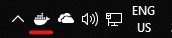
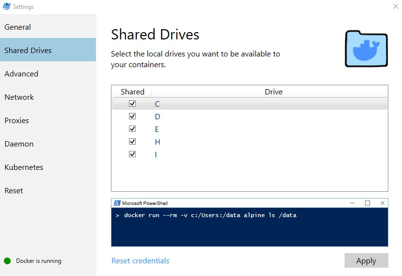

# 1 Drupal Installation

Download: [Drupal v8.6.10](https://www.drupal.org/project/drupal/releases/8.6.10)

## Voraussetzungen

* PHP Version 5.5.9 oder höher (PHP 7.2 oder höher wird empfohlen).
  * [Microsoft Web Platform](https://www.microsoft.com/web/downloads/platform.aspx), oder
  * via Chocolatey: `choco install -y php --version 7.3.1`
* Eines der Folgenden Datenbank-Systeme
  * [MariaDB](https://downloads.mariadb.org/interstitial/mariadb-10.3.13/winx64-packages/mariadb-10.3.13-winx64.msi/from/http%3A//mirror.netcologne.de/mariadb/),
    * via Chocolatey: `choco install -y mariadb --version 10.3.13`
  * [MySQL](https://dev.mysql.com/downloads/file/?id=484919), oder
    * via Chocolatey: `choco install -y mysql --version 8.0.15`
  * [SQLite](https://sqlite.org/download.html)
    * via Chocolatey: `choco install -y sqlite --version 3.27.1`
    * **Hinweis** Eine installation von SQLite ist nicht notwendig um es in PHP zu benutzen, kann aber hilfreich sein, um die Datenbank manuell zu bearbeiten.
* Composer
  * Installations-Datei: [installer](https://getcomposer.org/installer)
  * via Chocolatey: `choco install -y composer --version 4.10.0`

## Oder: via Docker

Docker ist ein Container Service (ähnlich wie Virtuelle Maschinen) mit vorkonfigurierten Images für Drupal, MySQL, MariaDB und so weiter. Container beeinflussen das System nicht, sollange sie nicht laufen und lassen das Datei-System unberührt. Container können einfach gelöscht und gebupdatet werden.

Docker für Windows wird mit folgendem Installations-Program installiert: [Docker Installer](https://download.docker.com/win/stable/Docker%20for%20Windows%20Installer.exe). 

## Drupal Setup

Nach der installation der Voraussetzungen muss sichergestellt werden, dass der Service/Daemon des ausgesuchten Datenbank-Systems läuft (mit der Ausnahme von SQLite, welches Dateibasiert ist).

> **Hinweis**
> <br>
> In allen Code-Schnipseln wird das Drupal Root-Verzeichnis als `$DRUPAL_ROOT` bezeichnet. Das kann durch das eigene Verzeichnis ersetzt werden, oder man fügt es dem System als Umgebungsvariable hinzu.

### Schritt 1: Aufsetzen des Dateisystems

#### Via Download

Nun kann der Inhalt von `drupal-8.6.10.zip` (bzw. `drupal-8.6.10.tar.gz`) in ein beliebiges Verzeichnis entpackt werden. Dieses Verzeichnis dient als das Drupal Root-Verzeichnis (`$DRUPAL_ROOT`). Alle relativen Pfade gehen von diesem Verzeichnis aus.

In dem Verzeichnis befinden sich folgende Unter-Verzeichnisse:

* `modules`: Module die die Funktion von Drupal erweitern.
* `themes`: Designs die das Aussehen von Drupal verändern.
* `sites`: Beinhaltet die Konfiguration von Drupal, sowie Öffentliche zugängliche und Private Dateien.
  * Im falle einer einfachen Seite befinden sich alle weiteren Dateien und Verzeichnisse im Unter-Verzeichnis `default`
  * Im falle eines Multi-Site Setups enthält dieses Verzeichnis weitere Verzeichnisse für jede Sub-Seite (z.B.: `sites/site1`, `sites/site2`, etc.)
* `core` und `vendors`: Systemdaten von Drupal. Diese sollten nicht verändert werden.

#### Via Composer

Composer kann eine Drupal Installation automatisch herunterladen: `composer create-project drupal-composer/drupal-project:8.x-dev <Installations-Verzeichnis>`

```console
PS> mkdir -p "$DRUPAL_ROOT"
PS> composer create-project drupal-composer/drupal-project:8.x-dev "$DRUPAL_ROOT" --no-interaction
Installing drupal-composer/drupal-project (8.x-dev 4229acea4bb6181f421e8dd0e72a02ccdc98df1d)
...
```

> **Hinweis**
> <br>
> Wenn die Installation durch Composer durchgeführt wurde, befinden sich alle relevanten Verzeichnisse im Unter-Verzeichnis `web` <br>
> Nur `composer` und `drush` verwenden dann das Verzeichnis `$DRUPAL_ROOT`, alle anderen (z.B.: `php`) gehen von `$DRUPAL_ROOT/web` aus.

### Optional: Drush Installation

Drush (**Dru**pal **Sh**ell) ist ein Konsolen-Anwendung, die die Bedienung von Drupal erleichtert. Die Installation geschieht durch Composer im Drupal Root-Verzeichnis:

```console
$ composer require drush/drush
Using version ^9.5 for drush/drush
...
```

### Schritt 2: Starten des Drupal Servers

#### Via PHP

PHP hat einen eingebauten webserver. Dafür muss ein Terminal in `DRUPAL_ROOT` geöffnet werden, dann wird der Server mit dem Befehl `php -S localhost:8000` gestartet.
<!-- Für lokale Zwecke sollte `Adresse` mit `localhost` `127.0.0.1` ersetzt werden. `Port` ist eine beliebige Zahl zwischen `1` und `65535`, Webseiten sind für gewöhnlich über den Port `80` zu erreichen (im falle von `http`; `443` für `https`). Ist der Port `80` nicht verwendbar, kann ein Port über `1024` versucht werden. Zum lokalen testen von Webseiten wird meist ein vierstelliger Port mit `8` am Anfang gewählt (z.B. `8000` oder `8080`). -->

##### Beispiel: PHP Server

```console
PS> cd "$DRUPAL_ROOT"
PS> php -S localhost:8000
PHP 7.2.2 Development Server started at ...
Listening on http://localhost:8000
Document root is ...
Press Ctrl-C to quit.
```

#### Via Docker

* Starte den Datenbank Server:

  ```sh
  docker run --name 'drupal_datenbank' -e MYSQL_ROOT_PASSWORD='passwort' -e MYSQL_DATABASE='drupal' -d mariadb
  ```

* Starte die Webseite:

  ```sh
  docker run --name 'drupal_webseite' --link 'drupal_datenbank:datenbank' -v "$DRUPAL_ROOT:/var/www/html" -p '8000:80' -d drupal
  ```

  Wobei in diesem Fall `$DRUPAL_ROOT` der **absolute Pfad** zum Verzeichnis sein muss.

  Um ein Verzeichnis benutzen zu können, muss erst sein Laufwerk in Docker freigegeben werden. Docker läuft im Hintergrund und kann mit `Rechts-Klick > Settings` in der Symbolleiste unten rechts geöffnet werden. Wähle deine Laufwerke unter `Shared Drives` aus und klicke `Apply`.

  
  
  