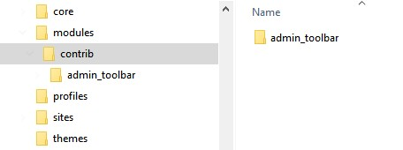
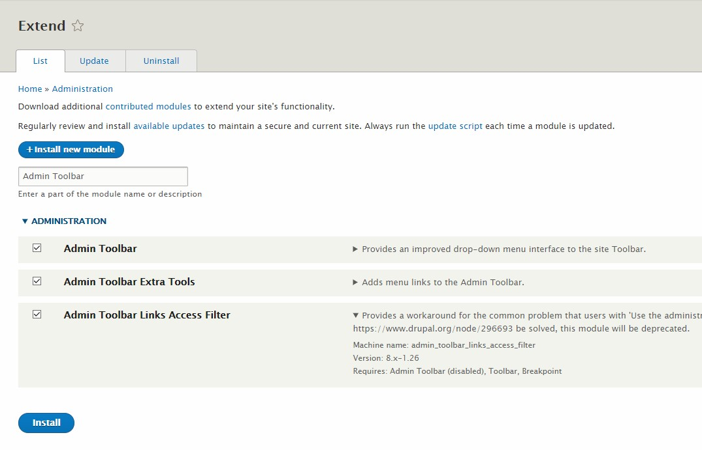

# 2 Drupal Konfiguration

## Setup

> **Hinweis**
>  
> Beispielwerte für die Konfiguration können aus der Datei `2.1 Beispielwerte zur Konfiguration.md` entnommen werden.

> **Hinweis**
>  
> Wer sein System mit Docker installiert hat, muss als Datenbank-Host nicht `localhost` oder `127.0.0.1` angeben, sondern `datenbank` (siehe `--link` Option beim starten des Docker Containers).

<!-- ### Via Web-Interface -->

Nach dem der Drupal Server gestartet wurde, kann auf die lokale Webseite zugegriffen werden (z.B.: [`http://localhost:8000`](http://localhost:8000)). Folge dort den Anweisungen bis zum Punkt `Datenbank einrichten`. Welches Profil beim einrichten gewählt wird ist für dieses Dokument nicht wichtig. Hier wird jedoch von `Minimal` ausgegangen.

Unter `Datenbank einrichten` muss nun das zuvor konfigurierte Datenbank-System ausgewählt werden. Ist das gewünschte System nicht zu sehen, konnte es nicht von Drupal gefunden, werden. Ggf. stimmt dann etwas nicht mit der installation von PHP oder dem Datenbank-System.

Als nächstes werden die grundlegenden Einstellungen der Webseite vorgenommen und der Administrator angelegt.

> **Hinweis**
>  
> Standardmäßig können keine Emails vom System verschickt werden, daher ist es egal was als Email eingetragen wird.
<!-- 
### Via Drush

Drush kann die Einrichtung selbstständig vornehmen: `drush site:install <profil> --locale=de`, wobei `<profil>` eines von `standard` oder `minimal` sein muss. Im anschluss werden nach den Datenbank-Einstellungen gefragt.

> **Hinweis**
>  
> Wer SQLite benutzen möchte muss an den Befehl noch (z.B.) `--db-url="sqlite://meine_datenbank.sqlite"` anhängen. -->

## Module Herunterladen und Aktivieren

Die meisten Funktionen von Drupal werden durch Module bereitgestellt. Die von Drupal mitgelieferten Module befinden sich im `core` Verzeichnis, aber weitere Module können heruntergeladen oder selber programmiert werden. Eigene Module und Module von Dritten werden in das Verzeichnis `modules` heruntergeladen. Diese Module können dann unter dem Menü-Punkt [Erweitern](http://localhost:8000/admin/modules) Installiert werden.

Welche Module vorinstalliert sind hängt von dem bei der Installation ausgewählten Profil ab.

### Beispiel anhand von Admin Toolbar und Pathauto

Wir Installieren das Modul [Admin Toolbar](https://www.drupal.org/project/admin_toolbar/releases/8.x-1.26), welches Drop-Down Funktionalität zur Admin-Toolbar hinzufügt und [Pathauto](https://www.drupal.org/project/pathauto/releases/8.x-1.3), welches automatisch benutzerfreundliche Links für erstellten Inhalt anlegt.

* Pathauto braucht zusätzlich die Module [Chaos Tools](https://www.drupal.org/project/ctools/releases/8.x-3.2) und [Tokens](https://www.drupal.org/project/token/releases/8.x-1.5).
* Für jedes Module: Wähle entweder das `tar.gz` oder das `zip` Archiv und entpacke es nach `modules`.

  <!--  -->

* In der Admin-Toolbar, klicke auf `Erweitern`.
* Mit der Suchleiste, suche nach `Admin Toolbar`, oder suche das Modul aus der Liste raus.
* Setze einen Haken bei `Admin Toolbar`, bei `Admin Toolbar Extra Tools`, und bei `Admin Toolbar Links Access Filter` und klicke auf `Installieren`.

  

* Mit der Suchleiste, suche nach `Pathauto`, oder suche das Modul aus der Liste raus.
* Setze einen Haken bei `Pathauto` und klicke auf `Installieren`.
  * Die Module `Chaos Tools` und `Tokens` werden durch `Pathauto` automatisch installiert.

Das System weist ggf. auf Module hin, die mit Installiert werden müssen. In dem Fall klicke auf OK und warte auf den Abschluss der Installation.

Manche Module fügen Einstellungen unter [Konfiguration](http://localhost:8000/admin/config) hinzu.

## Themes Herunterladen und Aktivieren

Themes sind für das Layout und generelle Aussehen der Webseite zuständig. Ihre Installation ist weitestgehens ähnlich wie die der Module, nur werden sie in `themes` entpackt und werden unter [Design](http://localhost:8000/admin/appearance) aktiviert.

Es gibt zwei Arten von Themes: 'Normale' Themes und Admin Themes. Ein normales Theme ist das eigentliche Design der Seite, während Admin Themes nur in den [Administrations-Seiten](http://localhost:8000/admin) sichtbar sind.

### Beispiel anhand von Nexus und Adminimal

Wir installieren zwei Themes: [Nexus](https://www.drupal.org/project/nexus/releases/8.x-1.4) und das Admin Theme [Adminimal](https://www.drupal.org/project/adminimal_theme/releases/8.x-1.4).

* Für beide Themes: Wähle entweder das `tar.gz` oder das `zip` Archiv und entpacke es nach `themes`.
* In der Admin-Toolbar, klicke auf `Design`.
* Unter `Nicht-Installierte Themes`, klicke `Installieren und als Vorgabe verwenden` bei `Nexus` und `Installieren` bei `Adminimal`.
* Unten, unter Verwaltungstheme, wähle `Adminimal` aus und klicke auf `Konfiguration speichern`.

Die Änderungen sollten sofort sichtbar sein.
