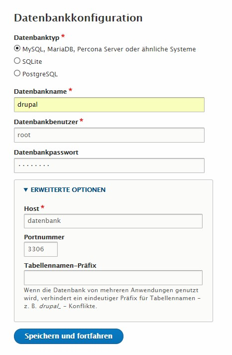

# 1.2 Beispielwerte zur Konfiguration

## Sprache

> Deutsch

<!-- Wenn  die Nachricht `Translationserver Offline` erscheint muss die [Übersetzungsdatei von Drupals Server](https://localize.drupal.org) selber heruntergeladen und in den ordner `$DRUPAL_ROOT/sites/default/files/translations` verschoben werden. -->

## Profil

> Minimal

## Datenbank

|Feld|Wert|
|---:|----|
|**Datenbanktyp**|MySQL|
|**Datenbankname**|drupal|
|**Datenbankbenutzer**|root|
|**Datenbankpasswort**|`<dein Datenbank-Passwort>`|
|**Host**|`localhost` (Oder, für Docker: `datenbank`)|
|**Port**|3306|

> **Hinweis**
>  
> Wer sein System mit Docker installiert hat, muss als Datenbank-Host nicht `localhost` oder `127.0.0.1` angeben, sondern `datenbank` (siehe `--link` Option beim starten des Docker Containers).

<!-- |Datenbank Datei|`sites/default/files/.ht.sqlite`| -->

## Konfiguration

|Feld|Wert|
|----|----|
|**Name der Seite**|Mein Journal|
|**Email der Seite**|email@example.com|
|**Username**|admin|
|**Passwort**|`<ein beliebiges Passwort>`|
|**Email**|email@example.com|
|**Standard Land**|Deutschland|
|**Standard Zeitzone**|Berlin|